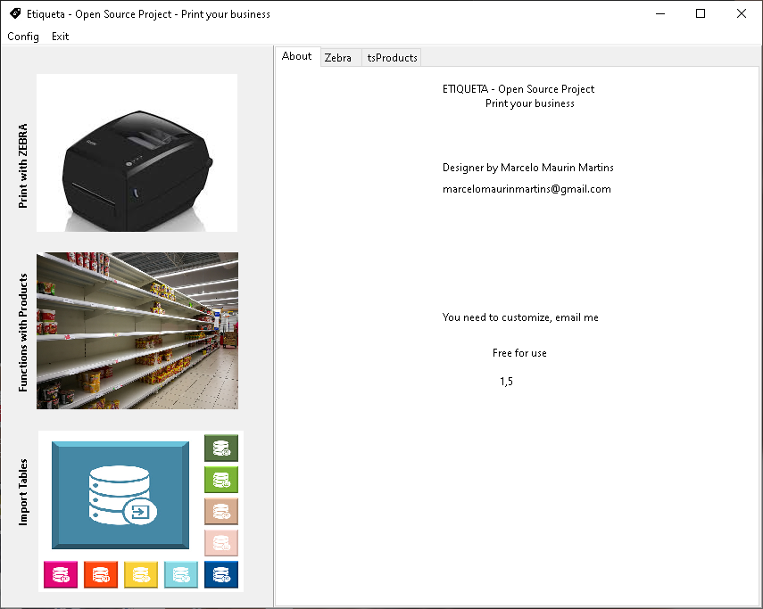
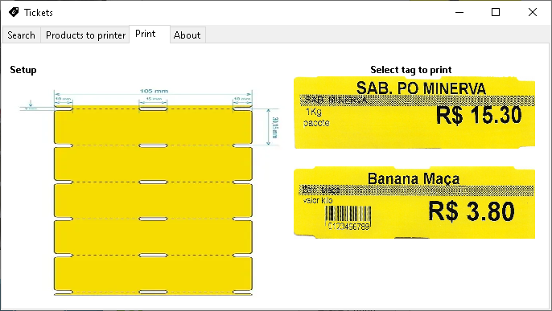
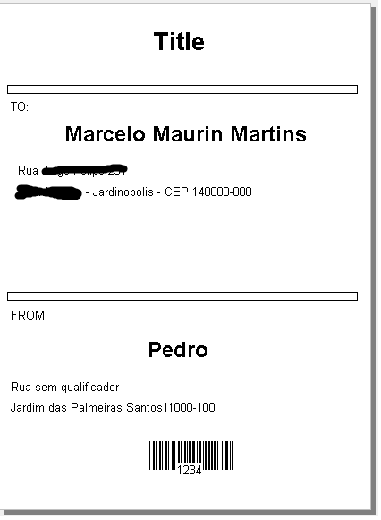

# Etiquetas

**Etiquetas** é um sistema desktop para gerenciamento e impressão de etiquetas, desenvolvido em **Lazarus / Free Pascal**, com banco de dados **SQLite** e foco em operação simples para pequenos negócios, comércios, laboratórios, almoxarifados e rotinas administrativas que precisam emitir etiquetas com rapidez.

O projeto nasceu para facilitar a criação, seleção, importação e impressão de etiquetas em impressoras compatíveis com o ambiente do sistema operacional, com destaque para uso com **impressoras Zebra**, etiquetas de gôndola, etiquetas de laboratório, mala direta e QR Code PIX.

---

## Visão comercial

O Etiquetas busca resolver um problema comum em operações comerciais e administrativas: transformar dados simples de produtos, endereços ou identificações em etiquetas prontas para impressão, sem depender de planilhas manuais ou sistemas grandes demais para tarefas pequenas.

Com ele, o usuário pode manter uma base local de produtos e endereços, importar dados por CSV, selecionar registros para impressão e gerar etiquetas em fluxos separados conforme o tipo de uso.

---

## Principais recursos

- Cadastro e gerenciamento local de produtos.
- Impressão de etiquetas de gôndola / preço.
- Seleção de produtos para fila de impressão.
- Importação de produtos via CSV.
- Importação de endereços via CSV para mala direta.
- Importação de etiquetas de laboratório via CSV.
- Impressão de etiquetas de mala direta com remetente e destinatário.
- Impressão de etiquetas de laboratório com código de barras.
- Geração e impressão de QR Code PIX a partir de uma string informada.
- Configuração de banco SQLite e biblioteca `sqlite3.dll`.
- Configuração dos dados da empresa usados em etiquetas de mala direta.
- Integração com impressão padrão do sistema operacional.

---

## Módulos do sistema

| Módulo | Finalidade |
|---|---|
| **Gôndola / Produtos** | Pesquisa produtos, seleciona itens e imprime etiquetas de preço. |
| **Importação CSV** | Importa bases de produtos, endereços e etiquetas de laboratório. |
| **Mala Direta** | Seleciona destinatários e imprime etiquetas de envio. |
| **Etiqueta de Laboratório** | Gera etiquetas com rótulos e código de barras. |
| **PIX Brasil** | Gera QR Code com base em uma string PIX e envia para impressão. |
| **Configuração** | Define banco de dados, biblioteca SQLite, empresa, endereço e impressora. |

---

## Documentação

A documentação principal está na pasta [`doc`](doc/README.md):

- [Guia de instalação](doc/instalacao.md)
- [Manual do usuário](doc/manual_usuario.md)
- [Configuração de impressora](doc/configuracao_impressora.md)
- [Importação de CSV](doc/importacao_csv.md)
- [Documentação técnica](doc/documentacao_tecnica.md)
- [Solução de problemas](doc/solucao_de_problemas.md)

---

## Requisitos básicos

### Para usuário final

- Windows ou Linux com ambiente gráfico.
- Impressora instalada no sistema operacional.
- Banco SQLite `etiqueta.db` disponível na pasta esperada ou configurado pelo sistema.
- Biblioteca SQLite configurada corretamente, especialmente no Windows com `sqlite3.dll`.

### Para desenvolvedor

- Lazarus / Free Pascal.
- ZeosLib.
- Fortes Report para Lazarus.
- Bibliotecas utilizadas pelo projeto, como Rx, lNet visual e componente de código de barras.

---

## Estrutura do repositório

| Pasta | Descrição |
|---|---|
| `src/` | Código-fonte Lazarus / Pascal do sistema. |
| `db/` | Banco de dados base do sistema. |
| `sqlite/` | Bibliotecas SQLite utilizadas pela aplicação. |
| `csv/` | Modelos ou arquivos de importação CSV. |
| `img/` | Imagens, ícones e capturas de tela. |
| `install/win/` | Arquivos relacionados à instalação no Windows. |
| `tools/SQLiteStudio/` | Ferramenta auxiliar para inspeção/manutenção do SQLite. |
| `doc/` | Documentação de instalação, uso e suporte. |

---

## Fluxo básico de uso

1. Instale ou copie o sistema para uma pasta local.
2. Abra o sistema Etiquetas.
3. Acesse **Configuração** e confira o caminho do banco SQLite e da biblioteca SQLite.
4. Configure os dados da empresa, quando for usar mala direta.
5. Importe produtos, endereços ou etiquetas de laboratório via CSV.
6. Selecione os registros desejados.
7. Escolha o tipo de etiqueta.
8. Imprima usando a impressora configurada no sistema operacional.

---

## Status do projeto

O projeto está funcional como aplicação desktop de etiquetas, com módulos específicos já implementados. Alguns pontos ainda podem evoluir para fortalecer a apresentação comercial, como empacotamento de releases, instalador padronizado, validações mais amigáveis, manual com imagens e revisão de mensagens internas para português.

---

## Screenshots

---

## Autor

Desenvolvido por **Marcelo Maurin Martins**.

GitHub: [marcelomaurin](https://github.com/marcelomaurin)

---

## Licença

Consulte os arquivos do repositório para informações de licença. Caso o projeto seja distribuído comercialmente, recomenda-se incluir um arquivo `LICENSE` formal.
